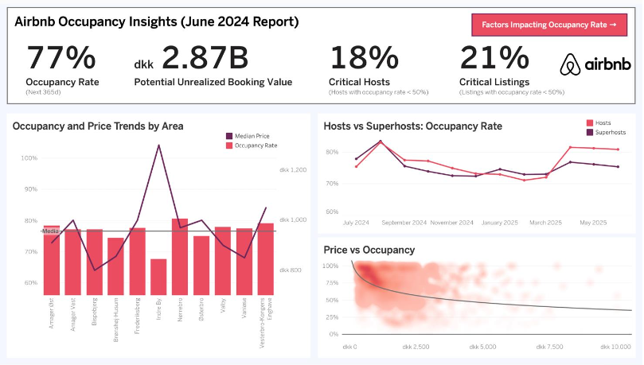
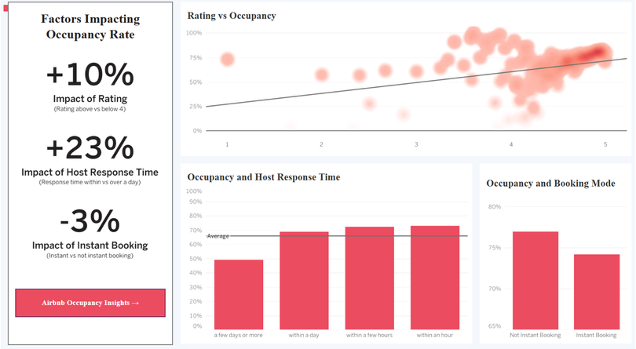

© 2025 Ludovico Francia. All rights reserved.
# 🏘️ Airbnb Listings Occupancy Analysis
**Data Management & Visualization to Maximize Revenue**

## 🔧 Tech Stack
`Python · Pandas · SQL · PostgreSQL · Data Modeling · Tableau · Data Visualization`

## Project Overview

**Business Objective**

Airbnb Denmark wanted to understand how to **increase Occupancy Rate** for listings in Copenhagen, in order to maximize:

- Nights Booked
- Gross Booking Value (GBV)

**Approach**

I built an end-to-end **data management and visualization pipeline**:

- Cleaned and structured large, messy Airbnb datasets
- Designed a normalized **PostgreSQL analytical database**
- Built **Tableau dashboards** to uncover the main drivers of occupancy

**Key Outcomes**

- Identified **price, ratings, host response time, and booking mode** as key occupancy drivers
- Estimated **DKK 2.87B in unrealized booking value** due to unoccupied nights

## 🏢 Business Context

Airbnb operates a **platform business model**, earning commissions from bookings made between hosts and guests.

In Copenhagen:

- Airbnb is a major player in the hospitality market
- Occupancy Rate directly impacts:
    - Nights booked
    - Gross Booking Value (GBV)
    - Platform revenue

Management asked the data team:

> “How can we increase occupancy across listings without harming the platform’s ecosystem?”
> 

## 🎯 Problem Framing

### Core Metric

**Occupancy Rate**

→ % of days a listing is booked over a given period

Increasing occupancy:

- Raises GBV
- Improves host satisfaction
- Strengthens Airbnb’s marketplace liquidity

### Key Question

What levers can Airbnb realistically use to increase occupancy?

- Pricing strategies?
- Host behavior?
- Platform features?

## 📊 Data Sources

Three Airbnb datasets for Copenhagen:

- **calendar2024.csv** → daily availability & prices (365 days per listing)
- **listings2024.csv** → listing & host attributes
- **reviews2024.csv** → guest reviews and ratings

📌 The analysis focused on **future availability data** to estimate occupancy trends.

## 🧹 Data Cleaning & Preparation

### Tools

- Python (Pandas)
- Jupyter Notebooks

### Key Cleaning Steps

- Converted dates, booleans, and numeric fields to correct types
- Removed redundant or fully-missing columns
- Standardized price values and capped outliers
- Fixed inconsistent neighborhood names
- Cleaned free-text review fields

### Handling Missing Prices (Important)

- **7,313 listings** had missing prices
- Leveraged the fact that:
    - Prices in the calendar dataset are constant over time
- Recovered prices from `calendar2024.csv`
- Reduced missing prices to **0 without dropping records**

## 🧱 Data Modeling & Database Design

### Why a Relational Database?

- Faster querying
- Reduced redundancy
- Scalable for future analysis
- Direct BI tool integration

### Implementation

- PostgreSQL + pgAdmin
- Loaded cleaned CSVs into separate tables
- Normalized data to **3rd Normal Form**

### Key Modeling Decisions

- Split reviews into:
    - `reviews`
    - `reviewers`
- Decomposed listings into:
    - `listings`
    - `hosts`
    - `availability`
    - `listing_reviews_summary`

## ⚠️ Interpretation & Assumptions

A crucial part of this project was **being explicit about limitations**.

### Occupancy Assumption

- `available = False` → listing is booked and generating revenue

⚠️ In reality:

- Hosts may block calendars
- Booking time caps may apply

This assumption may **overestimate true occupancy**, but it provides:

- A consistent proxy
- Comparable insights across listings

## 📊 Dashboard Design

Two Tableau dashboard views were created, following:

- GQM framework (Goal → Questions → Metrics)
- Schneiderman’s mantra:
    - Overview first
    - Zoom & filter
    - Details on demand

## 📈 Dashboard 1 — Airbnb Occupancy Insights

### Key Metrics

- Average Occupancy Rate: **77%**
- Estimated unrealized booking value: **DKK 2.87B**
- Critical hosts (<50% occupancy): **18%**
- Critical listings: **21%**

💡 With an estimated 15% commission, Airbnb may be missing **DKK 431M+** in annual revenue.

### Insights

- Strong **negative correlation between price and occupancy**
- Clear seasonality:
    - Low season: December, February
    - High season: April, August
- Expensive neighborhoods (e.g. Indre By) show lower occupancy

📌 Pricing is a powerful but delicate lever.

## 🔍 Dashboard 2 — Factors Impacting Occupancy (Beyond Price)

This view focuses on **non-pricing levers** Airbnb can influence.

### Key Findings

- ⭐ **+10% occupancy** for listings with rating > 4
- ⏱️ **+23% occupancy** when hosts respond within 24h
- 🔁 Listings *without* Instant Booking show **+3% occupancy**

### Interpretation

- Trust and communication matter more than convenience alone
- Guests value responsiveness and transparency
- Platform features can shape host behavior

## 💡 Strategic Recommendations

### For Airbnb

- Educate hosts on:
    - Pricing strategies
    - Importance of ratings
    - Fast response times
- Introduce:
    - Host response nudges
    - AI-assisted messaging
    - Trust-building features

### For Hosts

- Improve controllable rating factors:
    - Cleanliness
    - Communication
    - Accuracy of listings
- Optimize pricing within local clusters

## 🚀 What I’d Do Next

- Analyze **short-term availability windows** (1–3 months)
- Segment listings by cluster (price, size, neighborhood)
- Combine occupancy with **actual revenue data**
- Build predictive models for demand forecasting
- Run A/B tests on pricing and host nudges